<div align="center">


# Nexora AI — Premium AI Marketplace

**A dual-app marketplace for discovering, buying &amp; selling curated AI models.**
One account to shop *and* sell · Indonesian payments · a separate internal console — all in a single React + Vite codebase.

<p>
  
  
  
  
  
  
</p>

<br/>

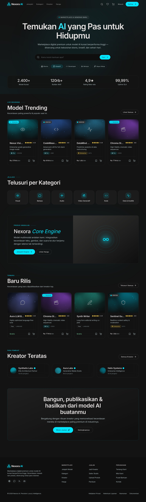

</div>

---

## ✨ Overview

Nexora AI is a **fully interactive, stateful** marketplace web app — not static mockups. It is built from a *Precision Luxury* design language (deep-graphite glassmorphism, electric-blue accents, editorial typography) and is fully localized to **Bahasa Indonesia** with **Rupiah** pricing and local payment rails (QRIS / Virtual Account / e-wallet).

It ships as **two apps in one codebase**, modelled on how Shopee / Tokopedia actually work:

- 🛒 **Consumer Marketplace** — one account both **shops and sells**. Any user can *Buka Toko* (open a store) to start selling — no separate seller account.
- 🛡️ **Nexora Console** — a **separate internal app on its own port** for **Admin** (moderation) and **Developer** (API platform), staff-only with 2FA.

> Every screen is interactive. State (auth, cart, wishlist, orders, the seller sales ledger) is persisted to `localStorage`, so sessions survive refreshes.

---

## 🖼️ Preview

<table>
  <tr>
    <td width="50%">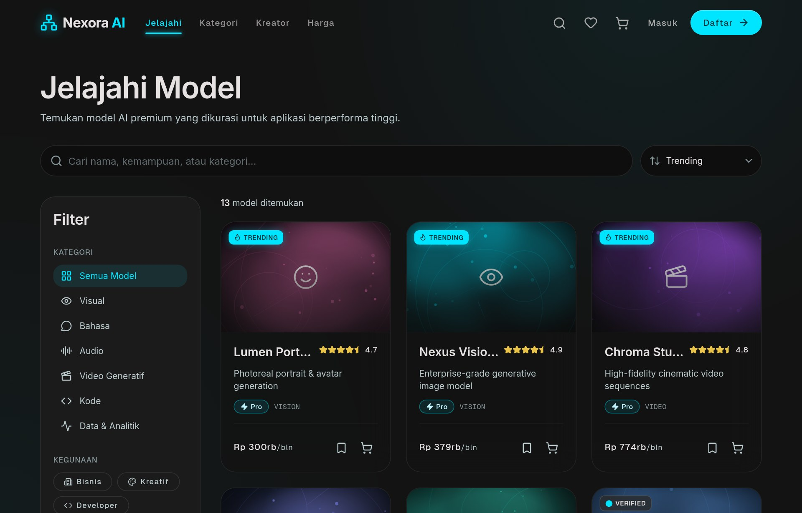<br/><sub><b>Explore</b> — live search · multi-filter · loading states</sub></td>
    <td width="50%">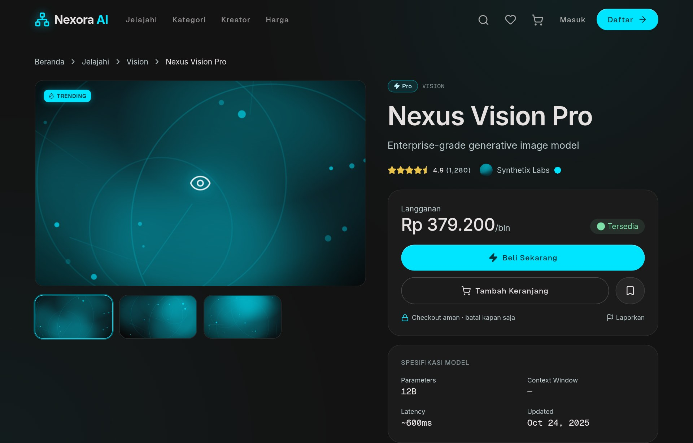<br/><sub><b>Product detail</b> — gallery · specs · reviews · Rupiah</sub></td>
  </tr>
  <tr>
    <td>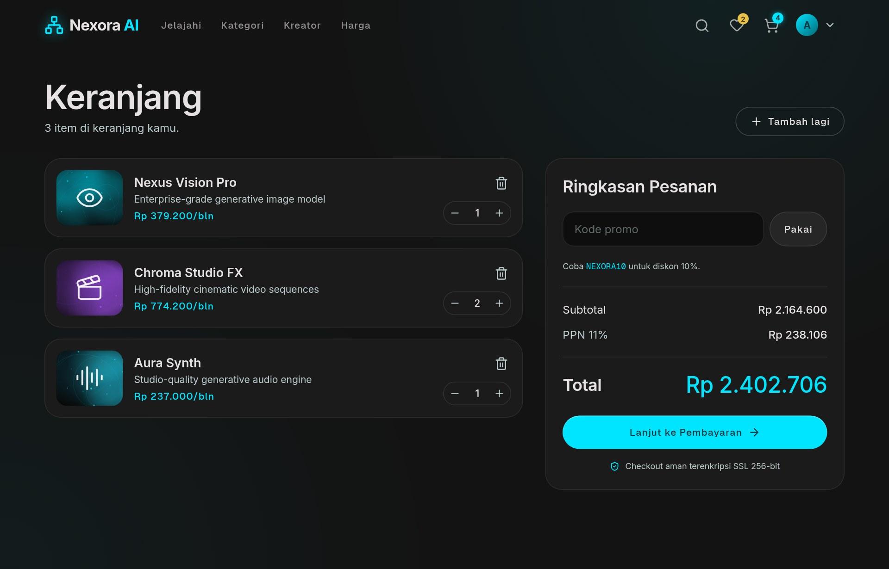<br/><sub><b>Cart</b> — promo codes · PPN 11% · IDR totals</sub></td>
    <td>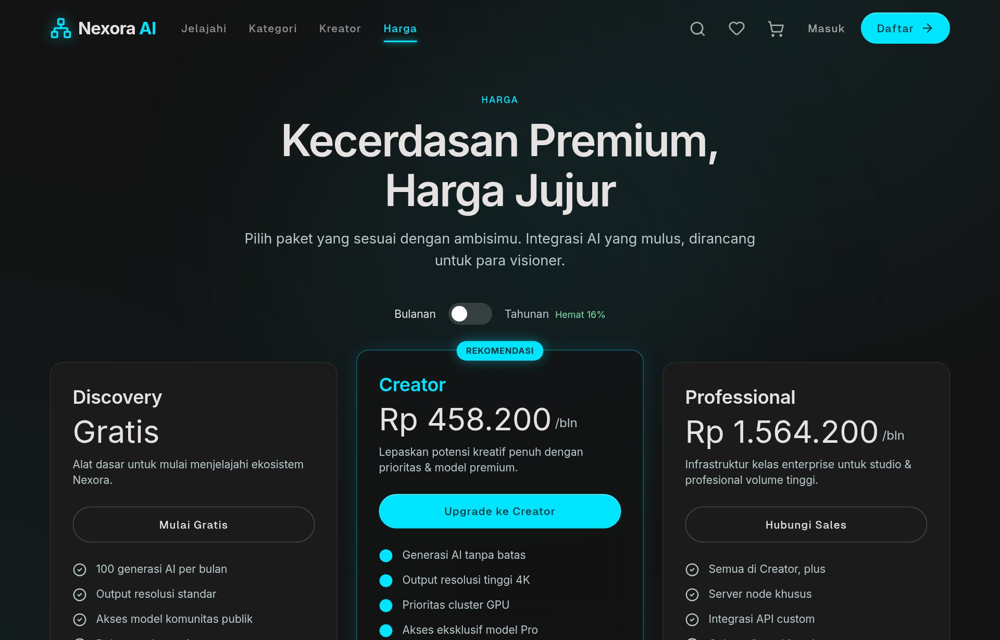<br/><sub><b>Pricing</b> — monthly/annual · FAQ</sub></td>
  </tr>
  <tr>
    <td>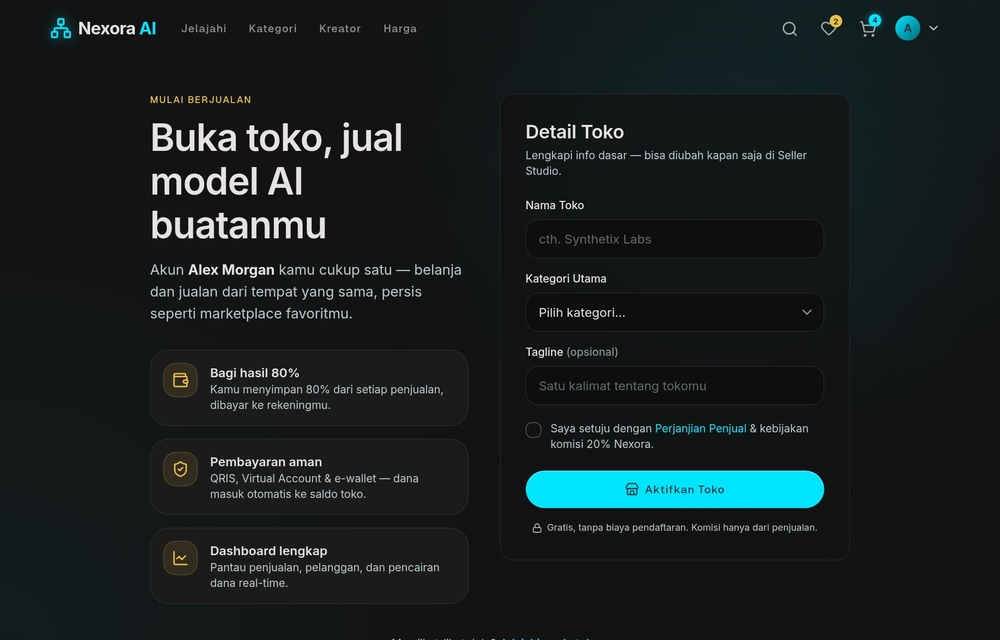<br/><sub><b>Buka Toko</b> — turn any shopper into a seller</sub></td>
    <td>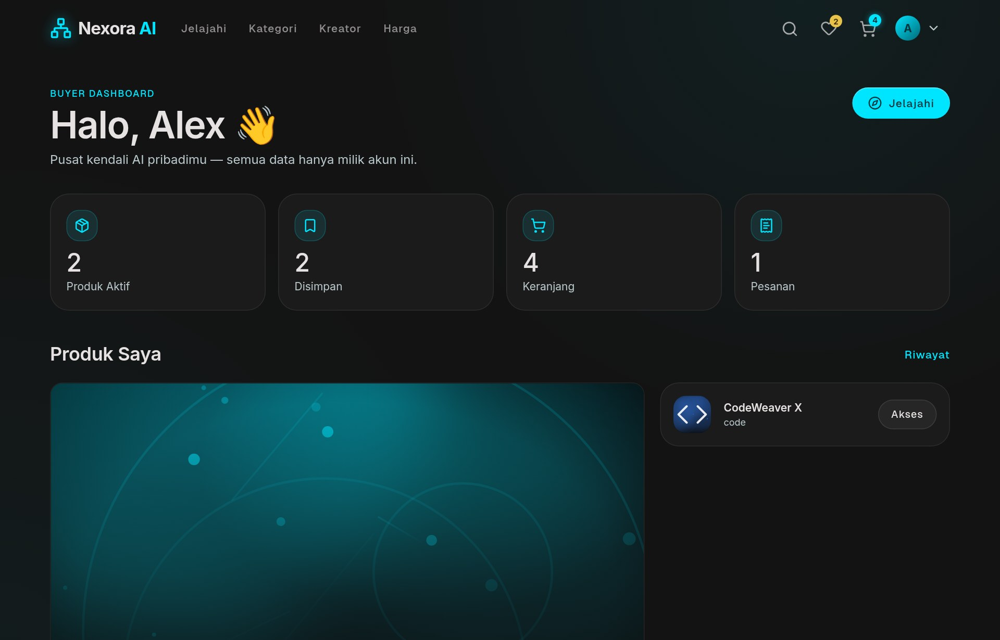<br/><sub><b>Buyer dashboard</b> — library · recommendations</sub></td>
  </tr>
  <tr>
    <td colspan="2">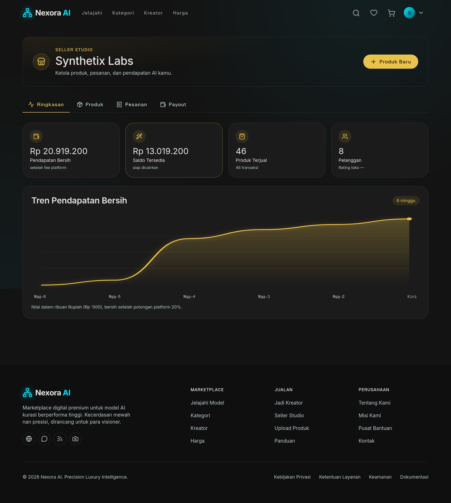<br/><sub><b>Seller Studio</b> — real sales ledger → earnings → secure (2FA) payouts, product CRUD</sub></td>
  </tr>
</table>

### 🛡️ Nexora Console — separate internal app (port 5174)

<table>
  <tr>
    <td width="50%">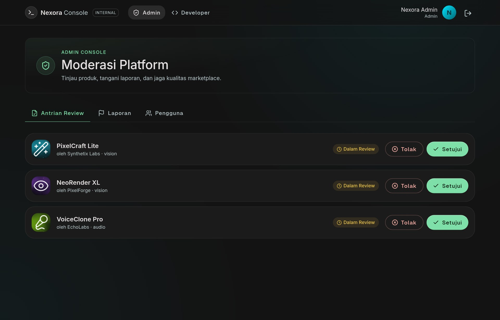<br/><sub><b>Admin</b> — moderation queue · reports · users</sub></td>
    <td width="50%">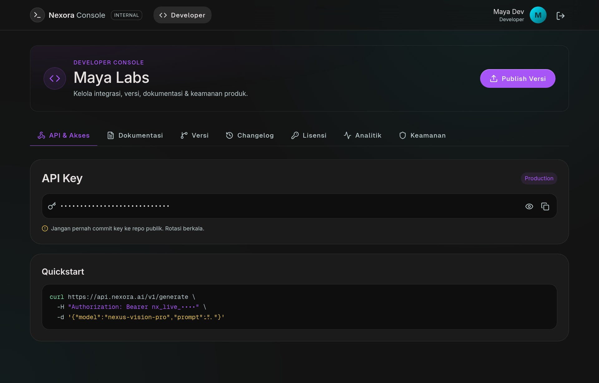<br/><sub><b>Developer</b> — API keys · versions · analytics</sub></td>
  </tr>
</table>

---

## 🏬 Two apps, one codebase

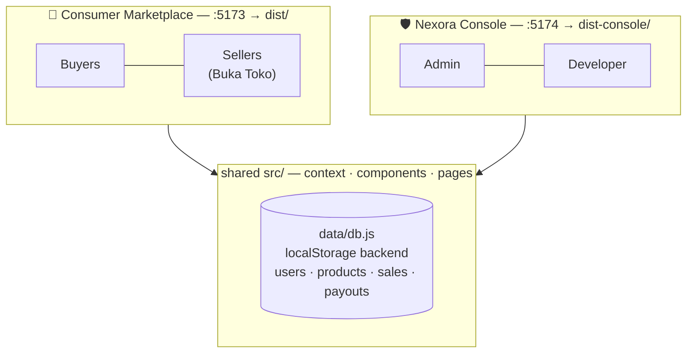

Both apps share the same `src/` (context, components, pages) and the same `localStorage` "backend". Swap `data/db.js` for a real API and the two apps light up against live data together. The console uses **hash routing**, so it deploys as a standalone static app with no server rewrites.

---

## 🚀 Features

| Area | What works |
| --- | --- |
| **Discovery** | Home, Explore with live search, multi-filter (category / use-case / tier / rating) + sorting, loading skeletons, category &amp; creator browsing |
| **Product** | Rich detail page (gallery, capabilities, specs, reviews, related), quick-view modal |
| **Commerce** | Cart with quantity + promo codes, multi-step checkout, **Indonesian payments** (QRIS / Virtual Account / e-wallet) with live status &amp; expiry, wishlist |
| **One account, buy + sell** | Single account shops &amp; sells — **Buka Toko** onboarding turns any shopper into a seller (Shopee/Tokopedia-style) |
| **Selling** | Seller Studio wired to a real **sales ledger → earnings → payouts**: 80/20 split, product CRUD, payout-account onboarding, **2FA-gated withdrawals** |
| **Console (separate app)** | **Admin** moderation queue / reports / users · **Developer** API keys / versions / analytics — staff-only login with 2FA |
| **Accounts &amp; security** | Mock auth, email verification, 2FA, active-session/device management, role-based access |
| **Localization** | 100% Bahasa Indonesia · Rupiah pricing everywhere · PPN 11% |
| **UX** | Responsive (desktop top-nav + mobile bottom-nav), toasts, 404, route-aware scroll, `localStorage` persistence |

### 🔁 The selling loop (verified end-to-end)

A buyer **browses → opens a seller's live listing → buys → pays**, and the sale lands in that seller's ledger at the correct **80% net** — earnings and the withdrawable balance update in real time, ready to cash out to a verified bank account.

---

## 🎨 Design system

- **Color** — Deep graphite base (`#131313` / `#0e0e0e`), Electric Blue accent (`#00e5ff`), Champagne Gold for premium tiers, role accents (seller gold, developer violet, admin green).
- **Type** — Inter (display/body) + Geist Sans/Mono (labels/metadata), **self-hosted** via `@fontsource` (no CDN).
- **Icons** — `lucide-react` 2px-stroke SVGs, fully bundled.
- **Artwork** — Product/creator thumbnails are generated as **self-contained seeded SVGs** (`ModelArtwork`) — no external images, nothing ever 404s.
- **Depth** — Glassmorphism (backdrop blur + hairline borders) and soft cyan glows instead of heavy shadows.

> No runtime depends on any external service — fonts, icons and imagery are all bundled.

---

## ⚡ Getting started

```bash
npm install                # install dependencies

# 🛒 Consumer marketplace (buyers + sellers)
npm run dev                # dev server       → http://localhost:5173
npm run build              # build            → dist/
npm run preview            # preview          → http://localhost:4173

# 🛡️ Nexora Console — internal Admin + Developer app (separate port)
npm run dev:console        # dev server       → http://localhost:5174/console.html
npm run build:console      # build            → dist-console/
npm run preview:console    # preview          → http://localhost:4174/console.html

npm run build:all          # build both apps
npm run smoke              # SSR render-check every consumer route (no browser)
```

### 👤 Demo accounts

Password for all: **`Demo1234!`**

| Role | Email | App | Notes |
| --- | --- | --- | --- |
| 🛒 Buyer | `buyer@nexora.ai` | Marketplace | Seeded library, wishlist &amp; orders |
| 🏬 Seller | `seller@nexora.ai` | Marketplace | Live listings, sales ledger &amp; payouts · 2FA |
| 🛡️ Admin | `admin@nexora.ai` | Console | Moderation &amp; oversight · 2FA |
| 🧑‍💻 Developer | `dev@nexora.ai` | Console | API platform |

---

## 🗂️ Project structure

```
index.html               # Consumer app entry            (:5173 → dist/)
console.html             # Nexora Console entry           (:5174 → dist-console/)
vite.config.js           # Consumer build config
vite.console.config.js   # Console build config
src/
├── components/          # Navbar, Footer, ModelCard, QuickViewModal, Icon,
│                        #   ModelArtwork (SVG), AreaChart, Toaster, RouteGuards…
├── context/
│   └── AppContext.jsx   # Global state: auth, cart, wishlist, orders, seller economy
├── data/
│   ├── models.js        # Catalog of AI models, categories, creators
│   ├── db.js            # localStorage "backend": users, sessions, products, sales, payouts
│   ├── payment.js       # Indonesian payments (QRIS / VA / e-wallet) + Rupiah helpers
│   └── security.js      # Validation + simulated OTP / 2FA primitives
├── pages/               # Home, Explore, ProductDetail, Cart, Checkout, Payment,
│                        #   Seller Studio, Buka Toko, Pricing, Settings, Auth, About, Help…
├── console/             # 🛡️ Nexora Console app — main · ConsoleApp · Layout · Login
├── App.jsx              # Consumer routes + layouts
├── main.jsx             # Consumer entry (fonts + providers)
└── index.css            # Tailwind layers + glass / glow utilities
```

---

## 🌐 Deploy

Both apps are static SPAs. The **consumer app** builds with `npm run build` → `dist/` (SPA deep-link fallback preconfigured via `vercel.json`, `netlify.toml` + `public/_redirects`). The **internal console** builds with `npm run build:console` → `dist-console/` and deploys separately (e.g. an `admin.` subdomain or an access-restricted host) — it uses hash routing, so it needs no server rewrites.

[](https://vercel.com/new/clone?repository-url=https://github.com/joshuasetiawann/ai-marketplace-website)
[](https://app.netlify.com/start/deploy?repository=https://github.com/joshuasetiawann/ai-marketplace-website)

---

## 🧪 Verification

`npm run smoke` server-renders every consumer route through Vite + React Router and asserts each mounts without errors — a fast, browser-free guard against regressions.

## 🛠 Tech

React 18 · React Router 6 · Vite 5 (dual config) · Tailwind CSS 3 · lucide-react · @fontsource

---

<div align="center"><sub>© Nexora AI · Precision Luxury Intelligence</sub></div>
