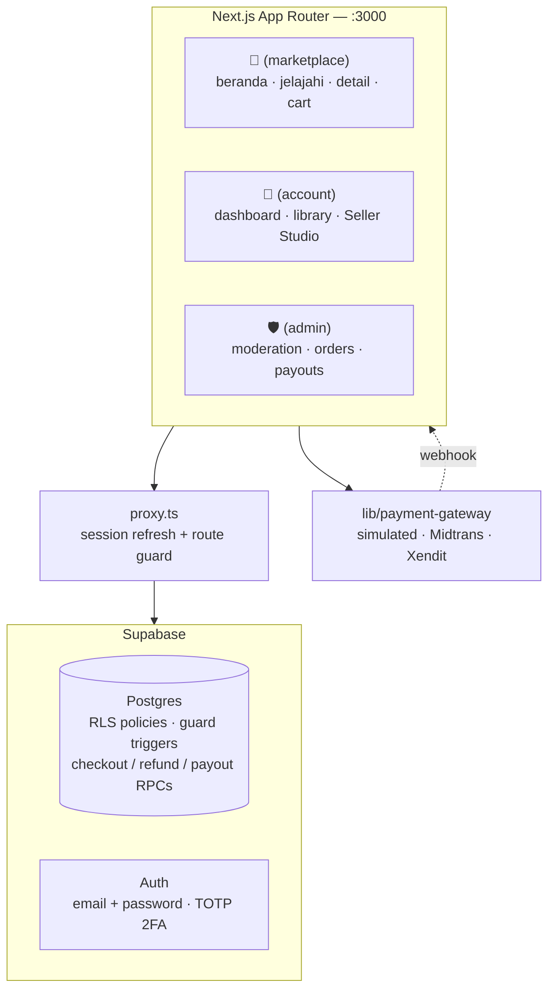

<div align="center">


# Nexora AI — Premium AI Marketplace

**A marketplace for discovering, buying &amp; selling curated AI models.**
One account to shop *and* sell · Indonesian payments · a staff-only admin area — Next.js App Router on Supabase Postgres.

<p>
  
  
  
  
  
  
</p>

<br/>


</div>

---

## ✨ Overview

Nexora AI is a **full-stack** marketplace web app — not static mockups. It is built from a *Precision Luxury* design language (deep-graphite glassmorphism, electric-blue accents, editorial typography) and is fully localized to **Bahasa Indonesia** with **Rupiah** pricing and local payment rails (QRIS / Virtual Account / e-wallet).

It is modelled on how Shopee / Tokopedia actually work:

- 🛒 **Marketplace** — one account both **shops and sells**. Any user can *Buka Toko* (open a store) to start selling — no separate seller account.
- 🛡️ **Admin area** (`/admin`) — moderation, orders, payouts and users, gated by an `admin` role in the database, not by a client-side check.

> State lives in **Postgres**, not the browser: auth sessions are httpOnly cookies, and every read is filtered by row-level security, so a user only ever sees rows they own. Money paths (checkout, refunds, payouts) run as `security definer` RPCs — the client cannot insert an order or a payout directly.

---

## 🖼️ Preview

<table>
  <tr>
    <td width="50%"><br/><sub><b>Explore</b> — live search · multi-filter · loading states</sub></td>
    <td width="50%"><br/><sub><b>Product detail</b> — gallery · specs · reviews · Rupiah</sub></td>
  </tr>
  <tr>
    <td><br/><sub><b>Cart</b> — promo codes · PPN 11% · IDR totals</sub></td>
    <td><br/><sub><b>Pricing</b> — monthly/annual · FAQ</sub></td>
  </tr>
  <tr>
    <td><br/><sub><b>Buka Toko</b> — turn any shopper into a seller</sub></td>
    <td><br/><sub><b>Buyer dashboard</b> — library · recommendations</sub></td>
  </tr>
  <tr>
    <td colspan="2"><br/><sub><b>Seller Studio</b> — real sales ledger → earnings → secure (2FA) payouts, product CRUD</sub></td>
  </tr>
</table>

### 🛡️ Admin area — `/admin`, staff only

<table>
  <tr>
    <td width="50%"><br/><sub><b>Admin</b> — moderation queue · reports · users</sub></td>
    <td width="50%"><br/><sub><b>Developer</b> — API keys · versions · analytics</sub></td>
  </tr>
</table>

---

## 🏬 Architecture



Reads go through Server Components; every write is a **Server Action** in `lib/actions/`. The public catalog is cached with `"use cache"` + `cacheTag` (`lib/catalog-data.ts`) and invalidated by tag when a product, review or store changes — so browsing is cheap without ever serving one user's data to another.

---

## 🚀 Features

| Area | What works |
| --- | --- |
| **Discovery** | Home, Explore with live search, multi-filter (category / use-case / tier / rating) + sorting, loading skeletons, category &amp; creator browsing |
| **Product** | Rich detail page (gallery, capabilities, specs, reviews, related), quick-view modal |
| **Commerce** | Cart with quantity + promo codes, multi-step checkout, **Indonesian payments** (QRIS / Virtual Account / e-wallet) with live status &amp; expiry, wishlist |
| **One account, buy + sell** | Single account shops &amp; sells — **Buka Toko** onboarding turns any shopper into a seller (Shopee/Tokopedia-style) |
| **Selling** | Seller Studio wired to a real **sales ledger → earnings → payouts**: 80/20 split, product CRUD, payout-account onboarding, **2FA-gated withdrawals** |
| **Admin** | Moderation queue, orders, payouts, contact messages, user roles — `/admin`, gated by an `admin` role in Postgres |
| **Accounts &amp; security** | Supabase Auth (email + password), email verification, TOTP 2FA with AAL2 step-up, row-level security on every table |
| **Localization** | 100% Bahasa Indonesia · Rupiah pricing everywhere · PPN 11% |
| **UX** | Responsive (desktop top-nav + mobile bottom-nav), loading skeletons, 404 &amp; error boundaries — cart, wishlist and orders persist in Postgres, so they follow the account across devices |

### 🔁 The selling loop (verified end-to-end)

A buyer **browses → opens a seller's live listing → buys → pays**, and the sale lands in that seller's ledger at the correct **80% net** — earnings and the withdrawable balance update in real time, ready to cash out to a verified bank account.

---

## 🎨 Design system

- **Color** — Deep graphite base (`#131313` / `#0e0e0e`), Electric Blue accent (`#00e5ff`), Champagne Gold for premium tiers, role accents (seller gold, developer violet, admin green).
- **Type** — Inter (display/body) + Geist Sans/Mono (labels/metadata), self-hosted at build time via `next/font` (no CDN request at runtime).
- **Icons** — `lucide-react` 2px-stroke SVGs, fully bundled.
- **Artwork** — Product/creator thumbnails are generated as **self-contained seeded SVGs** (`ModelArtwork`) — no external images, nothing ever 404s.
- **Depth** — Glassmorphism (backdrop blur + hairline borders) and soft cyan glows instead of heavy shadows.

> No runtime depends on any external service — fonts, icons and imagery are all bundled.

---

## ⚡ Getting started

Prerequisites: **Node 20+**, and **Docker** running (the local Supabase stack runs in containers).

```bash
npm install                   # install dependencies
npx playwright install chromium   # only needed for npm run test:e2e

npx supabase start            # Postgres + Auth + Studio in Docker (first run pulls images)
cp .env.example .env.local    # then paste the URL + keys that `supabase start` printed
npm run seed:users            # demo accounts (re-run after every `supabase db reset`)

npm run dev                   # dev server → http://localhost:3000
```

`supabase start` also prints the local dashboards:

| Service | URL | What it's for |
| --- | --- | --- |
| Studio | http://127.0.0.1:44323 | Browse tables, run SQL |
| **Mailpit** | http://127.0.0.1:44324 | **Every auth email lands here** — local Supabase never sends to a real inbox |
| API | http://127.0.0.1:44321 | The URL for `NEXT_PUBLIC_SUPABASE_URL` |

These are `443xx`, not the CLI's default `543xx`. Windows' TCP dynamic port range
is 49152–65535, so the defaults sit inside it: after a Docker Desktop restart
WinNAT can reserve them and `supabase start` then either fails with *"ports are
not available … forbidden by its access permissions"* or reports success while
the containers come up with **no host binding at all**. `443xx` is below that
range, so it cannot happen. See the comment at the top of `supabase/config.toml`.

```bash
npm run build                 # production build → .next/
npm start                     # serve the production build
npm run clean                 # delete .next / .next-dev if the dev server ever gets confused
npm test                      # unit + DB-security tests (vitest)
npm run test:e2e              # end-to-end (Playwright, builds and serves on :3100)
npm run lint                  # eslint
```

> Signup confirmation is **off for local dev** (`supabase/config.toml`), so a new account is usable immediately. On a hosted project, keep confirmation **on** — the app handles both: with confirmation on, signup lands on `/verify-email` instead of the dashboard.

### 👤 Demo accounts

Created by `npm run seed:users`. Password for both: **`Demo1234!`**

| Role | Email | Notes |
| --- | --- | --- |
| 🛒 Buyer / seller | `user@nexora.ai` | A normal account — shops, and can *Buka Toko* to start selling |
| 🛡️ Admin | `admin@nexora.ai` | Same login, plus the `/admin` area (`role = admin` in `profiles`) |

---

## 🗂️ Project structure

```
app/
├── (marketplace)/       # Public: beranda, jelajahi, kategori, kreator, detail,
│                        #   cart, checkout, wishlist, pricing, help, about
├── (account)/           # Signed in: dashboard, library, orders, settings,
│                        #   sell/ → Seller Studio (products, sales, earnings, payouts)
├── (admin)/admin/       # Staff: moderation, orders, payouts, users, messages
├── (auth)/              # login (+ 2FA), register, verify-email, reset password
├── auth/callback/       # Exchanges the email link's code for a session cookie
├── api/payments/webhook # Payment-provider callback → marks the order paid
└── layout.tsx           # Fonts, metadata, <html lang="id">
components/              # Navbar, ModelCard, ModelArtwork (seeded SVG), forms…
lib/
├── actions/             # Server Actions — every write (auth, checkout, products,
│                        #   reviews, payouts, admin) lives here
├── supabase/            # client · server · middleware · admin (service role) · public
├── catalog-data.ts      # Cached public-catalog reads ("use cache" + cacheTag)
├── payment-gateway/     # simulated | midtrans | xendit behind one interface
└── pricing.ts economics.ts cart.ts ratelimit.ts env.ts
proxy.ts                 # Session refresh + protected-route guard (Next 16 middleware)
supabase/
├── migrations/          # Schema, RLS policies, guard triggers, RPCs
├── seed.sql             # Curated house catalog
└── config.toml          # Local stack settings
tests/                   # vitest (pricing, economics, DB security) + e2e/ (Playwright)
```

---

## 🌐 Deploy

Deploy to Vercel against a hosted Supabase project:

1. Create the Supabase project and push the schema — `npx supabase link --project-ref <ref>` then `npx supabase db push`.
2. Set the environment variables from `.env.example` in the Vercel project (`NEXT_PUBLIC_SUPABASE_URL`, `NEXT_PUBLIC_SUPABASE_ANON_KEY`, `SUPABASE_SERVICE_ROLE_KEY`, `NEXT_PUBLIC_SITE_URL`, plus the payment provider keys). **`SUPABASE_SERVICE_ROLE_KEY` is server-only — never give it a `NEXT_PUBLIC_` prefix.**
3. In Supabase → Authentication, add `{SITE_URL}/auth/callback` to the redirect allow-list and keep email confirmation **on**.
4. For real payments, set `PAYMENT_PROVIDER=midtrans|xendit` and point the provider's webhook at `POST {SITE_URL}/api/payments/webhook`.

[](https://vercel.com/new/clone?repository-url=https://github.com/joshuasetiawann/ai-marketplace-website)

---

## 🧪 Verification

- `npm test` — pricing/economics units, plus a **DB security suite** that signs in as a real user and asserts RLS actually blocks direct order inserts, cross-user reads and self-promotion to admin. It runs only when `.env.local` points at a live Supabase; without one it skips.
- `npm run test:e2e` — Playwright against a production build on `:3100`: register, route guards, login, browse, and a full buy → pay flow.
- `npm run lint` · `npx tsc --noEmit`

## 🛠 Tech

Next.js 16 (App Router, Turbopack, Server Actions) · React 19 · TypeScript 5 · Tailwind CSS 4 · Supabase (Postgres + RLS, Auth, `@supabase/ssr`) · lucide-react · vitest · Playwright

---

<div align="center"><sub>© Nexora AI · Precision Luxury Intelligence</sub></div>
